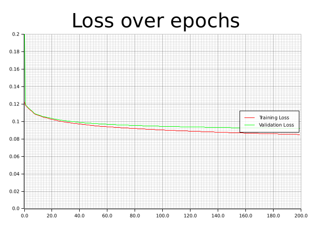
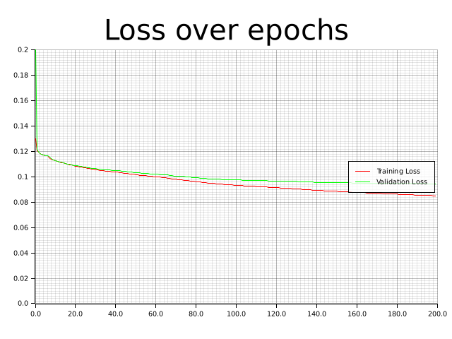

# Scylla

*AI generated by DALLE*

Named after the mythical 6 headed sea monster, Scylla is a multi-agent neural network designed to play chess **like a human** within a given elo range. The design is based on [this paper](https://cs231n.stanford.edu/reports/2015/pdfs/ConvChess.pdf) by Barak Oshri and Nishith Khandwala of Stanford University. The novel idea borrowed here is the used of 7 separate neural networks (one for piece selection, and one of each of the 6 pieces in chess). The composition of the piece selection matrix with the highest values from the relevant move selector matrices decides which piece is moved where on a given turn.

## How to play with Scylla
To play with Scylla, [install rust](https://www.rust-lang.org/tools/install). Then download and build this repo with release mode turned on. This will used the pre-trained binaries in `trained_network/`.

```
cargo run --release
```

## How to train Scylla
If you would like to train Scylla yourself, you will have to generate the datasets. The sister program [Scylla_preprocessor](https://github.com/Nianzu/Scylla_preprocessor), will help you do this. Follow the instructions there to generate datasets, then delete the binaries in `trained_network/`, (or just delete the ones you want to retrain) and run Scylla!

For plotters, you will have to install some dependencies on your system.
```
sudo apt install pkg-config libfreetype6-dev libfontconfig1-dev
```
## Methodology

pawn            |  knight | bishop
:-------------------------:|:-------------------------:|:-------------------------:
  |   | 
rook            |  queen | king
  |   | 
piece selector


## Known issues

 * General code cleanliness
    > If I had more time, I would have written a shorter \[crate\]. 
    >
    > -Blaise Pascal
 * Unknown elo
 * Only plays as white
 * Validation step contaminated with training data. May have lead to over-fitting.
 * ~~Panics if you or Scylla play an illegal move~~
 * Lack of documentation
 * Does not have a way to detect end of game
 * Only trained on 2000 vs 2000 games (might expect you not to make monumentally silly moves)
 * No concept of an opening
 * No provision for game to end by anything other than checkmate

## Sample game 
```
                                                     _:_    
                                                    '-.-'   
                                           ()      __.'.__  
                                        .-:--:-.  |_______| 
                                 ()      \____/    \=====/      ()          
                                 /\      {====}     )___(       /\               
                      (\=,      //\\      )__(     /_____\     //\\     (\=,        
      __    |'-'-'|  //  .\    (    )    /____\     |   |     (    )   //  .\   |'-'-'|    __  
     /  \   |_____| (( \_  \    )__(      |  |      |   |      )__(   (( \_  \  |_____|   /  \  
     \__/    |===|   ))  `\_)  /____\     |  |      |   |     /____\   ))  `\_)  |===|    \__/  
    /____\   |   |  (/     \    |  |      |  |      |   |      |  |   (/     \   |   |   /____\   
     |  |    |   |   | _.-'|    |  |      |  |      |   |      |  |    | _.-'|   |   |    |  |  
     |__|    )___(    )___(    /____\    /____\    /_____\    /____\    )___(    )___(    |__| 
    (====)  (=====)  (=====)  (======)  (======)  (=======)  (======)  (=====)  (=====)  (====)
    }===={  }====={  }====={  }======{  }======{  }======={  }======{  }====={  }====={  }===={
   (______)(_______)(_______)(________)(________)(_________)(________)(_______)(_______)(______)

                           .d8888b.                    888 888           
                           d88P  Y88b                   888 888          
                           Y88b.                        888 888          
                            "Y888b.    .d8888b 888  888 888 888  8888b.  
                               "Y88b. d88P"    888  888 888 888     "88b 
                                 "888 888      888  888 888 888 .d888888 
                           Y88b  d88P Y88b.    Y88b 888 888 888 888  888 
                            "Y8888P"   "Y8888P  "Y88888 888 888 "Y888888 
                                                    888                  
                                               Y8b d88P                  
                                                "Y88P"                   

                                  Ascii Art credit: Joan G. Stark
                                       Software by: Nico Zucca


Scylla plays e2e4
  ┌───┬───┬───┬───┬───┬───┬───┬───┐
1 │ ♖ │ ♘ │ ♗ │ ♔ │ ♕ │ ♗ │ ♘ │ ♖ │
  ├───┼───┼───┼───┼───┼───┼───┼───┤
2 │ ♙ │ ♙ │ ♙ │   │ ♙ │ ♙ │ ♙ │ ♙ │
  ├───┼───┼───┼───┼───┼───┼───┼───┤
3 │   │   │   │   │   │   │   │   │
  ├───┼───┼───┼───┼───┼───┼───┼───┤
4 │   │   │   │ ♙ │   │   │   │   │
  ├───┼───┼───┼───┼───┼───┼───┼───┤
5 │   │   │   │   │   │   │   │   │
  ├───┼───┼───┼───┼───┼───┼───┼───┤
6 │   │   │   │   │   │   │   │   │
  ├───┼───┼───┼───┼───┼───┼───┼───┤
7 │ ♟ │ ♟ │ ♟ │ ♟ │ ♟ │ ♟ │ ♟ │ ♟ │
  ├───┼───┼───┼───┼───┼───┼───┼───┤
8 │ ♜ │ ♞ │ ♝ │ ♚ │ ♛ │ ♝ │ ♞ │ ♜ │
  └───┴───┴───┴───┴───┴───┴───┴───┘
    h   g   f   e   d   c   b   a  
Your move: g7g6
Scylla plays d2d4
  ┌───┬───┬───┬───┬───┬───┬───┬───┐
1 │ ♖ │ ♘ │ ♗ │ ♔ │ ♕ │ ♗ │ ♘ │ ♖ │
  ├───┼───┼───┼───┼───┼───┼───┼───┤
2 │ ♙ │ ♙ │ ♙ │   │   │ ♙ │ ♙ │ ♙ │
  ├───┼───┼───┼───┼───┼───┼───┼───┤
3 │   │   │   │   │   │   │   │   │
  ├───┼───┼───┼───┼───┼───┼───┼───┤
4 │   │   │   │ ♙ │ ♙ │   │   │   │
  ├───┼───┼───┼───┼───┼───┼───┼───┤
5 │   │   │   │   │   │   │   │   │
  ├───┼───┼───┼───┼───┼───┼───┼───┤
6 │   │ ♟ │   │   │   │   │   │   │
  ├───┼───┼───┼───┼───┼───┼───┼───┤
7 │ ♟ │   │ ♟ │ ♟ │ ♟ │ ♟ │ ♟ │ ♟ │
  ├───┼───┼───┼───┼───┼───┼───┼───┤
8 │ ♜ │ ♞ │ ♝ │ ♚ │ ♛ │ ♝ │ ♞ │ ♜ │
  └───┴───┴───┴───┴───┴───┴───┴───┘
    h   g   f   e   d   c   b   a  
Your move: g8f6
Scylla plays b1c3
  ┌───┬───┬───┬───┬───┬───┬───┬───┐
1 │ ♖ │ ♘ │ ♗ │ ♔ │ ♕ │ ♗ │   │ ♖ │
  ├───┼───┼───┼───┼───┼───┼───┼───┤
2 │ ♙ │ ♙ │ ♙ │   │   │ ♙ │ ♙ │ ♙ │
  ├───┼───┼───┼───┼───┼───┼───┼───┤
3 │   │   │   │   │   │ ♘ │   │   │
  ├───┼───┼───┼───┼───┼───┼───┼───┤
4 │   │   │   │ ♙ │ ♙ │   │   │   │
  ├───┼───┼───┼───┼───┼───┼───┼───┤
5 │   │   │   │   │   │   │   │   │
  ├───┼───┼───┼───┼───┼───┼───┼───┤
6 │   │ ♟ │ ♞ │   │   │   │   │   │
  ├───┼───┼───┼───┼───┼───┼───┼───┤
7 │ ♟ │   │ ♟ │ ♟ │ ♟ │ ♟ │ ♟ │ ♟ │
  ├───┼───┼───┼───┼───┼───┼───┼───┤
8 │ ♜ │   │ ♝ │ ♚ │ ♛ │ ♝ │ ♞ │ ♜ │
  └───┴───┴───┴───┴───┴───┴───┴───┘
    h   g   f   e   d   c   b   a  
Your move: f8g7
Scylla plays g1f3
  ┌───┬───┬───┬───┬───┬───┬───┬───┐
1 │ ♖ │   │ ♗ │ ♔ │ ♕ │ ♗ │   │ ♖ │
  ├───┼───┼───┼───┼───┼───┼───┼───┤
2 │ ♙ │ ♙ │ ♙ │   │   │ ♙ │ ♙ │ ♙ │
  ├───┼───┼───┼───┼───┼───┼───┼───┤
3 │   │   │ ♘ │   │   │ ♘ │   │   │
  ├───┼───┼───┼───┼───┼───┼───┼───┤
4 │   │   │   │ ♙ │ ♙ │   │   │   │
  ├───┼───┼───┼───┼───┼───┼───┼───┤
5 │   │   │   │   │   │   │   │   │
  ├───┼───┼───┼───┼───┼───┼───┼───┤
6 │   │ ♟ │ ♞ │   │   │   │   │   │
  ├───┼───┼───┼───┼───┼───┼───┼───┤
7 │ ♟ │ ♝ │ ♟ │ ♟ │ ♟ │ ♟ │ ♟ │ ♟ │
  ├───┼───┼───┼───┼───┼───┼───┼───┤
8 │ ♜ │   │   │ ♚ │ ♛ │ ♝ │ ♞ │ ♜ │
  └───┴───┴───┴───┴───┴───┴───┴───┘
    h   g   f   e   d   c   b   a  
Your move: e8g8
Scylla plays e4e5
  ┌───┬───┬───┬───┬───┬───┬───┬───┐
1 │ ♖ │   │ ♗ │ ♔ │ ♕ │ ♗ │   │ ♖ │
  ├───┼───┼───┼───┼───┼───┼───┼───┤
2 │ ♙ │ ♙ │ ♙ │   │   │ ♙ │ ♙ │ ♙ │
  ├───┼───┼───┼───┼───┼───┼───┼───┤
3 │   │   │ ♘ │   │   │ ♘ │   │   │
  ├───┼───┼───┼───┼───┼───┼───┼───┤
4 │   │   │   │   │ ♙ │   │   │   │
  ├───┼───┼───┼───┼───┼───┼───┼───┤
5 │   │   │   │ ♙ │   │   │   │   │
  ├───┼───┼───┼───┼───┼───┼───┼───┤
6 │   │ ♟ │ ♞ │   │   │   │   │   │
  ├───┼───┼───┼───┼───┼───┼───┼───┤
7 │ ♟ │ ♝ │ ♟ │ ♟ │ ♟ │ ♟ │ ♟ │ ♟ │
  ├───┼───┼───┼───┼───┼───┼───┼───┤
8 │   │ ♚ │ ♜ │   │ ♛ │ ♝ │ ♞ │ ♜ │
  └───┴───┴───┴───┴───┴───┴───┴───┘
    h   g   f   e   d   c   b   a  
Your move: f6h5
Scylla plays f1e2
  ┌───┬───┬───┬───┬───┬───┬───┬───┐
1 │ ♖ │   │   │ ♔ │ ♕ │ ♗ │   │ ♖ │
  ├───┼───┼───┼───┼───┼───┼───┼───┤
2 │ ♙ │ ♙ │ ♙ │ ♗ │   │ ♙ │ ♙ │ ♙ │
  ├───┼───┼───┼───┼───┼───┼───┼───┤
3 │   │   │ ♘ │   │   │ ♘ │   │   │
  ├───┼───┼───┼───┼───┼───┼───┼───┤
4 │   │   │   │   │ ♙ │   │   │   │
  ├───┼───┼───┼───┼───┼───┼───┼───┤
5 │ ♞ │   │   │ ♙ │   │   │   │   │
  ├───┼───┼───┼───┼───┼───┼───┼───┤
6 │   │ ♟ │   │   │   │   │   │   │
  ├───┼───┼───┼───┼───┼───┼───┼───┤
7 │ ♟ │ ♝ │ ♟ │ ♟ │ ♟ │ ♟ │ ♟ │ ♟ │
  ├───┼───┼───┼───┼───┼───┼───┼───┤
8 │   │ ♚ │ ♜ │   │ ♛ │ ♝ │ ♞ │ ♜ │
  └───┴───┴───┴───┴───┴───┴───┴───┘
    h   g   f   e   d   c   b   a  
Your move: d7d6
Scylla plays e1g1
  ┌───┬───┬───┬───┬───┬───┬───┬───┐
1 │   │ ♔ │ ♖ │   │ ♕ │ ♗ │   │ ♖ │
  ├───┼───┼───┼───┼───┼───┼───┼───┤
2 │ ♙ │ ♙ │ ♙ │ ♗ │   │ ♙ │ ♙ │ ♙ │
  ├───┼───┼───┼───┼───┼───┼───┼───┤
3 │   │   │ ♘ │   │   │ ♘ │   │   │
  ├───┼───┼───┼───┼───┼───┼───┼───┤
4 │   │   │   │   │ ♙ │   │   │   │
  ├───┼───┼───┼───┼───┼───┼───┼───┤
5 │ ♞ │   │   │ ♙ │   │   │   │   │
  ├───┼───┼───┼───┼───┼───┼───┼───┤
6 │   │ ♟ │   │   │ ♟ │   │   │   │
  ├───┼───┼───┼───┼───┼───┼───┼───┤
7 │ ♟ │ ♝ │ ♟ │ ♟ │   │ ♟ │ ♟ │ ♟ │
  ├───┼───┼───┼───┼───┼───┼───┼───┤
8 │   │ ♚ │ ♜ │   │ ♛ │ ♝ │ ♞ │ ♜ │
  └───┴───┴───┴───┴───┴───┴───┴───┘
    h   g   f   e   d   c   b   a  
Your move: d6e5
Scylla plays d4e5
  ┌───┬───┬───┬───┬───┬───┬───┬───┐
1 │   │ ♔ │ ♖ │   │ ♕ │ ♗ │   │ ♖ │
  ├───┼───┼───┼───┼───┼───┼───┼───┤
2 │ ♙ │ ♙ │ ♙ │ ♗ │   │ ♙ │ ♙ │ ♙ │
  ├───┼───┼───┼───┼───┼───┼───┼───┤
3 │   │   │ ♘ │   │   │ ♘ │   │   │
  ├───┼───┼───┼───┼───┼───┼───┼───┤
4 │   │   │   │   │   │   │   │   │
  ├───┼───┼───┼───┼───┼───┼───┼───┤
5 │ ♞ │   │   │ ♙ │   │   │   │   │
  ├───┼───┼───┼───┼───┼───┼───┼───┤
6 │   │ ♟ │   │   │   │   │   │   │
  ├───┼───┼───┼───┼───┼───┼───┼───┤
7 │ ♟ │ ♝ │ ♟ │ ♟ │   │ ♟ │ ♟ │ ♟ │
  ├───┼───┼───┼───┼───┼───┼───┼───┤
8 │   │ ♚ │ ♜ │   │ ♛ │ ♝ │ ♞ │ ♜ │
  └───┴───┴───┴───┴───┴───┴───┴───┘
    h   g   f   e   d   c   b   a  
Your move: d8d1
Scylla plays f1d1
  ┌───┬───┬───┬───┬───┬───┬───┬───┐
1 │   │ ♔ │   │   │ ♖ │ ♗ │   │ ♖ │
  ├───┼───┼───┼───┼───┼───┼───┼───┤
2 │ ♙ │ ♙ │ ♙ │ ♗ │   │ ♙ │ ♙ │ ♙ │
  ├───┼───┼───┼───┼───┼───┼───┼───┤
3 │   │   │ ♘ │   │   │ ♘ │   │   │
  ├───┼───┼───┼───┼───┼───┼───┼───┤
4 │   │   │   │   │   │   │   │   │
  ├───┼───┼───┼───┼───┼───┼───┼───┤
5 │ ♞ │   │   │ ♙ │   │   │   │   │
  ├───┼───┼───┼───┼───┼───┼───┼───┤
6 │   │ ♟ │   │   │   │   │   │   │
  ├───┼───┼───┼───┼───┼───┼───┼───┤
7 │ ♟ │ ♝ │ ♟ │ ♟ │   │ ♟ │ ♟ │ ♟ │
  ├───┼───┼───┼───┼───┼───┼───┼───┤
8 │   │ ♚ │ ♜ │   │   │ ♝ │ ♞ │ ♜ │
  └───┴───┴───┴───┴───┴───┴───┴───┘
    h   g   f   e   d   c   b   a  
Your move: c8f5
Scylla plays c1e3
  ┌───┬───┬───┬───┬───┬───┬───┬───┐
1 │   │ ♔ │   │   │ ♖ │   │   │ ♖ │
  ├───┼───┼───┼───┼───┼───┼───┼───┤
2 │ ♙ │ ♙ │ ♙ │ ♗ │   │ ♙ │ ♙ │ ♙ │
  ├───┼───┼───┼───┼───┼───┼───┼───┤
3 │   │   │ ♘ │ ♗ │   │ ♘ │   │   │
  ├───┼───┼───┼───┼───┼───┼───┼───┤
4 │   │   │   │   │   │   │   │   │
  ├───┼───┼───┼───┼───┼───┼───┼───┤
5 │ ♞ │   │ ♝ │ ♙ │   │   │   │   │
  ├───┼───┼───┼───┼───┼───┼───┼───┤
6 │   │ ♟ │   │   │   │   │   │   │
  ├───┼───┼───┼───┼───┼───┼───┼───┤
7 │ ♟ │ ♝ │ ♟ │ ♟ │   │ ♟ │ ♟ │ ♟ │
  ├───┼───┼───┼───┼───┼───┼───┼───┤
8 │   │ ♚ │ ♜ │   │   │   │ ♞ │ ♜ │
  └───┴───┴───┴───┴───┴───┴───┴───┘
    h   g   f   e   d   c   b   a  
Your move: b8c6
Scylla plays c3d5
  ┌───┬───┬───┬───┬───┬───┬───┬───┐
1 │   │ ♔ │   │   │ ♖ │   │   │ ♖ │
  ├───┼───┼───┼───┼───┼───┼───┼───┤
2 │ ♙ │ ♙ │ ♙ │ ♗ │   │ ♙ │ ♙ │ ♙ │
  ├───┼───┼───┼───┼───┼───┼───┼───┤
3 │   │   │ ♘ │ ♗ │   │   │   │   │
  ├───┼───┼───┼───┼───┼───┼───┼───┤
4 │   │   │   │   │   │   │   │   │
  ├───┼───┼───┼───┼───┼───┼───┼───┤
5 │ ♞ │   │ ♝ │ ♙ │ ♘ │   │   │   │
  ├───┼───┼───┼───┼───┼───┼───┼───┤
6 │   │ ♟ │   │   │   │ ♞ │   │   │
  ├───┼───┼───┼───┼───┼───┼───┼───┤
7 │ ♟ │ ♝ │ ♟ │ ♟ │   │ ♟ │ ♟ │ ♟ │
  ├───┼───┼───┼───┼───┼───┼───┼───┤
8 │   │ ♚ │ ♜ │   │   │   │   │ ♜ │
  └───┴───┴───┴───┴───┴───┴───┴───┘
    h   g   f   e   d   c   b   a  
Your move: a8d8
Scylla plays d1e1
  ┌───┬───┬───┬───┬───┬───┬───┬───┐
1 │   │ ♔ │   │ ♖ │   │   │   │ ♖ │
  ├───┼───┼───┼───┼───┼───┼───┼───┤
2 │ ♙ │ ♙ │ ♙ │ ♗ │   │ ♙ │ ♙ │ ♙ │
  ├───┼───┼───┼───┼───┼───┼───┼───┤
3 │   │   │ ♘ │ ♗ │   │   │   │   │
  ├───┼───┼───┼───┼───┼───┼───┼───┤
4 │   │   │   │   │   │   │   │   │
  ├───┼───┼───┼───┼───┼───┼───┼───┤
5 │ ♞ │   │ ♝ │ ♙ │ ♘ │   │   │   │
  ├───┼───┼───┼───┼───┼───┼───┼───┤
6 │   │ ♟ │   │   │   │ ♞ │   │   │
  ├───┼───┼───┼───┼───┼───┼───┼───┤
7 │ ♟ │ ♝ │ ♟ │ ♟ │   │ ♟ │ ♟ │ ♟ │
  ├───┼───┼───┼───┼───┼───┼───┼───┤
8 │   │ ♚ │ ♜ │   │ ♜ │   │   │   │
  └───┴───┴───┴───┴───┴───┴───┴───┘
    h   g   f   e   d   c   b   a  
Your move: d8d5
Scylla plays a1d1
  ┌───┬───┬───┬───┬───┬───┬───┬───┐
1 │   │ ♔ │   │ ♖ │ ♖ │   │   │   │
  ├───┼───┼───┼───┼───┼───┼───┼───┤
2 │ ♙ │ ♙ │ ♙ │ ♗ │   │ ♙ │ ♙ │ ♙ │
  ├───┼───┼───┼───┼───┼───┼───┼───┤
3 │   │   │ ♘ │ ♗ │   │   │   │   │
  ├───┼───┼───┼───┼───┼───┼───┼───┤
4 │   │   │   │   │   │   │   │   │
  ├───┼───┼───┼───┼───┼───┼───┼───┤
5 │ ♞ │   │ ♝ │ ♙ │ ♜ │   │   │   │
  ├───┼───┼───┼───┼───┼───┼───┼───┤
6 │   │ ♟ │   │   │   │ ♞ │   │   │
  ├───┼───┼───┼───┼───┼───┼───┼───┤
7 │ ♟ │ ♝ │ ♟ │ ♟ │   │ ♟ │ ♟ │ ♟ │
  ├───┼───┼───┼───┼───┼───┼───┼───┤
8 │   │ ♚ │ ♜ │   │   │   │   │   │
  └───┴───┴───┴───┴───┴───┴───┴───┘
    h   g   f   e   d   c   b   a  
Your move: d5d1
Scylla plays e1d1
  ┌───┬───┬───┬───┬───┬───┬───┬───┐
1 │   │ ♔ │   │   │ ♖ │   │   │   │
  ├───┼───┼───┼───┼───┼───┼───┼───┤
2 │ ♙ │ ♙ │ ♙ │ ♗ │   │ ♙ │ ♙ │ ♙ │
  ├───┼───┼───┼───┼───┼───┼───┼───┤
3 │   │   │ ♘ │ ♗ │   │   │   │   │
  ├───┼───┼───┼───┼───┼───┼───┼───┤
4 │   │   │   │   │   │   │   │   │
  ├───┼───┼───┼───┼───┼───┼───┼───┤
5 │ ♞ │   │ ♝ │ ♙ │   │   │   │   │
  ├───┼───┼───┼───┼───┼───┼───┼───┤
6 │   │ ♟ │   │   │   │ ♞ │   │   │
  ├───┼───┼───┼───┼───┼───┼───┼───┤
7 │ ♟ │ ♝ │ ♟ │ ♟ │   │ ♟ │ ♟ │ ♟ │
  ├───┼───┼───┼───┼───┼───┼───┼───┤
8 │   │ ♚ │ ♜ │   │   │   │   │   │
  └───┴───┴───┴───┴───┴───┴───┴───┘
    h   g   f   e   d   c   b   a  
Your move: c6e5
Scylla plays f3e5
  ┌───┬───┬───┬───┬───┬───┬───┬───┐
1 │   │ ♔ │   │   │ ♖ │   │   │   │
  ├───┼───┼───┼───┼───┼───┼───┼───┤
2 │ ♙ │ ♙ │ ♙ │ ♗ │   │ ♙ │ ♙ │ ♙ │
  ├───┼───┼───┼───┼───┼───┼───┼───┤
3 │   │   │   │ ♗ │   │   │   │   │
  ├───┼───┼───┼───┼───┼───┼───┼───┤
4 │   │   │   │   │   │   │   │   │
  ├───┼───┼───┼───┼───┼───┼───┼───┤
5 │ ♞ │   │ ♝ │ ♘ │   │   │   │   │
  ├───┼───┼───┼───┼───┼───┼───┼───┤
6 │   │ ♟ │   │   │   │   │   │   │
  ├───┼───┼───┼───┼───┼───┼───┼───┤
7 │ ♟ │ ♝ │ ♟ │ ♟ │   │ ♟ │ ♟ │ ♟ │
  ├───┼───┼───┼───┼───┼───┼───┼───┤
8 │   │ ♚ │ ♜ │   │   │   │   │   │
  └───┴───┴───┴───┴───┴───┴───┴───┘
    h   g   f   e   d   c   b   a  
Your move: g7e5
Scylla plays e2f3
  ┌───┬───┬───┬───┬───┬───┬───┬───┐
1 │   │ ♔ │   │   │ ♖ │   │   │   │
  ├───┼───┼───┼───┼───┼───┼───┼───┤
2 │ ♙ │ ♙ │ ♙ │   │   │ ♙ │ ♙ │ ♙ │
  ├───┼───┼───┼───┼───┼───┼───┼───┤
3 │   │   │ ♗ │ ♗ │   │   │   │   │
  ├───┼───┼───┼───┼───┼───┼───┼───┤
4 │   │   │   │   │   │   │   │   │
  ├───┼───┼───┼───┼───┼───┼───┼───┤
5 │ ♞ │   │ ♝ │ ♝ │   │   │   │   │
  ├───┼───┼───┼───┼───┼───┼───┼───┤
6 │   │ ♟ │   │   │   │   │   │   │
  ├───┼───┼───┼───┼───┼───┼───┼───┤
7 │ ♟ │   │ ♟ │ ♟ │   │ ♟ │ ♟ │ ♟ │
  ├───┼───┼───┼───┼───┼───┼───┼───┤
8 │   │ ♚ │ ♜ │   │   │   │   │   │
  └───┴───┴───┴───┴───┴───┴───┴───┘
    h   g   f   e   d   c   b   a  
Your move: b7b5
Scylla plays e3h6
  ┌───┬───┬───┬───┬───┬───┬───┬───┐
1 │   │ ♔ │   │   │ ♖ │   │   │   │
  ├───┼───┼───┼───┼───┼───┼───┼───┤
2 │ ♙ │ ♙ │ ♙ │   │   │ ♙ │ ♙ │ ♙ │
  ├───┼───┼───┼───┼───┼───┼───┼───┤
3 │   │   │ ♗ │   │   │   │   │   │
  ├───┼───┼───┼───┼───┼───┼───┼───┤
4 │   │   │   │   │   │   │   │   │
  ├───┼───┼───┼───┼───┼───┼───┼───┤
5 │ ♞ │   │ ♝ │ ♝ │   │   │ ♟ │   │
  ├───┼───┼───┼───┼───┼───┼───┼───┤
6 │ ♗ │ ♟ │   │   │   │   │   │   │
  ├───┼───┼───┼───┼───┼───┼───┼───┤
7 │ ♟ │   │ ♟ │ ♟ │   │ ♟ │   │ ♟ │
  ├───┼───┼───┼───┼───┼───┼───┼───┤
8 │   │ ♚ │ ♜ │   │   │   │   │   │
  └───┴───┴───┴───┴───┴───┴───┴───┘
    h   g   f   e   d   c   b   a  
Your move: f8e8
Scylla plays d1e1
  ┌───┬───┬───┬───┬───┬───┬───┬───┐
1 │   │ ♔ │   │ ♖ │   │   │   │   │
  ├───┼───┼───┼───┼───┼───┼───┼───┤
2 │ ♙ │ ♙ │ ♙ │   │   │ ♙ │ ♙ │ ♙ │
  ├───┼───┼───┼───┼───┼───┼───┼───┤
3 │   │   │ ♗ │   │   │   │   │   │
  ├───┼───┼───┼───┼───┼───┼───┼───┤
4 │   │   │   │   │   │   │   │   │
  ├───┼───┼───┼───┼───┼───┼───┼───┤
5 │ ♞ │   │ ♝ │ ♝ │   │   │ ♟ │   │
  ├───┼───┼───┼───┼───┼───┼───┼───┤
6 │ ♗ │ ♟ │   │   │   │   │   │   │
  ├───┼───┼───┼───┼───┼───┼───┼───┤
7 │ ♟ │   │ ♟ │ ♟ │   │ ♟ │   │ ♟ │
  ├───┼───┼───┼───┼───┼───┼───┼───┤
8 │   │ ♚ │   │ ♜ │   │   │   │   │
  └───┴───┴───┴───┴───┴───┴───┴───┘
    h   g   f   e   d   c   b   a  
Your move: e5f4
Scylla plays h6f4
  ┌───┬───┬───┬───┬───┬───┬───┬───┐
1 │   │ ♔ │   │ ♖ │   │   │   │   │
  ├───┼───┼───┼───┼───┼───┼───┼───┤
2 │ ♙ │ ♙ │ ♙ │   │   │ ♙ │ ♙ │ ♙ │
  ├───┼───┼───┼───┼───┼───┼───┼───┤
3 │   │   │ ♗ │   │   │   │   │   │
  ├───┼───┼───┼───┼───┼───┼───┼───┤
4 │   │   │ ♗ │   │   │   │   │   │
  ├───┼───┼───┼───┼───┼───┼───┼───┤
5 │ ♞ │   │ ♝ │   │   │   │ ♟ │   │
  ├───┼───┼───┼───┼───┼───┼───┼───┤
6 │   │ ♟ │   │   │   │   │   │   │
  ├───┼───┼───┼───┼───┼───┼───┼───┤
7 │ ♟ │   │ ♟ │ ♟ │   │ ♟ │   │ ♟ │
  ├───┼───┼───┼───┼───┼───┼───┼───┤
8 │   │ ♚ │   │ ♜ │   │   │   │   │
  └───┴───┴───┴───┴───┴───┴───┴───┘
    h   g   f   e   d   c   b   a  
Your move: h5f4
Scylla plays e1e7
  ┌───┬───┬───┬───┬───┬───┬───┬───┐
1 │   │ ♔ │   │   │   │   │   │   │
  ├───┼───┼───┼───┼───┼───┼───┼───┤
2 │ ♙ │ ♙ │ ♙ │   │   │ ♙ │ ♙ │ ♙ │
  ├───┼───┼───┼───┼───┼───┼───┼───┤
3 │   │   │ ♗ │   │   │   │   │   │
  ├───┼───┼───┼───┼───┼───┼───┼───┤
4 │   │   │ ♞ │   │   │   │   │   │
  ├───┼───┼───┼───┼───┼───┼───┼───┤
5 │   │   │ ♝ │   │   │   │ ♟ │   │
  ├───┼───┼───┼───┼───┼───┼───┼───┤
6 │   │ ♟ │   │   │   │   │   │   │
  ├───┼───┼───┼───┼───┼───┼───┼───┤
7 │ ♟ │   │ ♟ │ ♖ │   │ ♟ │   │ ♟ │
  ├───┼───┼───┼───┼───┼───┼───┼───┤
8 │   │ ♚ │   │ ♜ │   │   │   │   │
  └───┴───┴───┴───┴───┴───┴───┴───┘
    h   g   f   e   d   c   b   a  
Your move: e8e7
Scylla plays c2c3
  ┌───┬───┬───┬───┬───┬───┬───┬───┐
1 │   │ ♔ │   │   │   │   │   │   │
  ├───┼───┼───┼───┼───┼───┼───┼───┤
2 │ ♙ │ ♙ │ ♙ │   │   │   │ ♙ │ ♙ │
  ├───┼───┼───┼───┼───┼───┼───┼───┤
3 │   │   │ ♗ │   │   │ ♙ │   │   │
  ├───┼───┼───┼───┼───┼───┼───┼───┤
4 │   │   │ ♞ │   │   │   │   │   │
  ├───┼───┼───┼───┼───┼───┼───┼───┤
5 │   │   │ ♝ │   │   │   │ ♟ │   │
  ├───┼───┼───┼───┼───┼───┼───┼───┤
6 │   │ ♟ │   │   │   │   │   │   │
  ├───┼───┼───┼───┼───┼───┼───┼───┤
7 │ ♟ │   │ ♟ │ ♜ │   │ ♟ │   │ ♟ │
  ├───┼───┼───┼───┼───┼───┼───┼───┤
8 │   │ ♚ │   │   │   │   │   │   │
  └───┴───┴───┴───┴───┴───┴───┴───┘
    h   g   f   e   d   c   b   a  
Your move: a7a6
Scylla plays f3c6
  ┌───┬───┬───┬───┬───┬───┬───┬───┐
1 │   │ ♔ │   │   │   │   │   │   │
  ├───┼───┼───┼───┼───┼───┼───┼───┤
2 │ ♙ │ ♙ │ ♙ │   │   │   │ ♙ │ ♙ │
  ├───┼───┼───┼───┼───┼───┼───┼───┤
3 │   │   │   │   │   │ ♙ │   │   │
  ├───┼───┼───┼───┼───┼───┼───┼───┤
4 │   │   │ ♞ │   │   │   │   │   │
  ├───┼───┼───┼───┼───┼───┼───┼───┤
5 │   │   │ ♝ │   │   │   │ ♟ │   │
  ├───┼───┼───┼───┼───┼───┼───┼───┤
6 │   │ ♟ │   │   │   │ ♗ │   │ ♟ │
  ├───┼───┼───┼───┼───┼───┼───┼───┤
7 │ ♟ │   │ ♟ │ ♜ │   │ ♟ │   │   │
  ├───┼───┼───┼───┼───┼───┼───┼───┤
8 │   │ ♚ │   │   │   │   │   │   │
  └───┴───┴───┴───┴───┴───┴───┴───┘
    h   g   f   e   d   c   b   a  
Your move: e7e1
You win by checkmate!
```